<p align="center"></p>

<h1 align="center" style="line-height:0;">Discord Readme Banner Generator</h1>

<br>

<p align="center">


</p>

<h2>What is this?</h2>
Discord Readme Banner Generator (or DRM for short), is an open source program that allows you to generate so called 'readme svgs' that house your discord account info.

<h2>Additional info</h2>

<details>
<summary>How to use?</summary>
Usage is simple.  To make the clubhouse appear, we need to say the magic words: "<a>https://willdev12.github.io/Discord-Readme-Banners/</a>".  Anything from there should be pretty self explanatory.
</details>

<details>
<summary>Embedding a banner</summary>
To embed a banner, you must first download it or copy the data: link.  Since Github doesn't like data URIs. we will need to suffice with the downloaded svg.  Simply upload said svg into your repo and tag it in your readme like this: "".
</details>

<details>
<summary>Want to contribute?</summary>
If so, go ahead!  I myself am newer to node and javascript so if anyone can help out with keeping this all under the willdev12.github domain please do so.  Any helpers will be mentioned near the bottom of this readme.
</details>

<h2>Example banners</h2>

  <br>
**please note that these are not valid discord credentials**

<h1>Like content like this?</h1>

Check out my [profile](https://github.com/WillDev12) or share it! (It means a lot to me)<br>
Also huge thanks to my other contributors!

```
https://github.com/WillDev12
https://github.com/kztera
```
